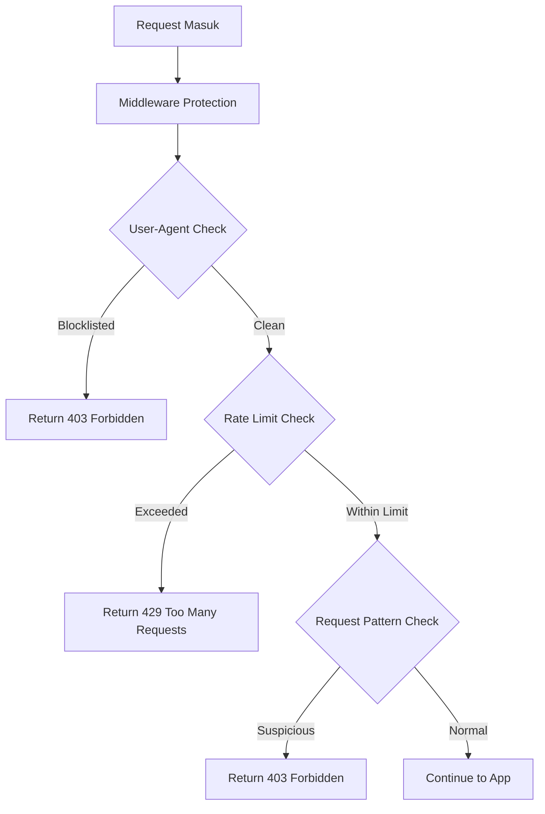
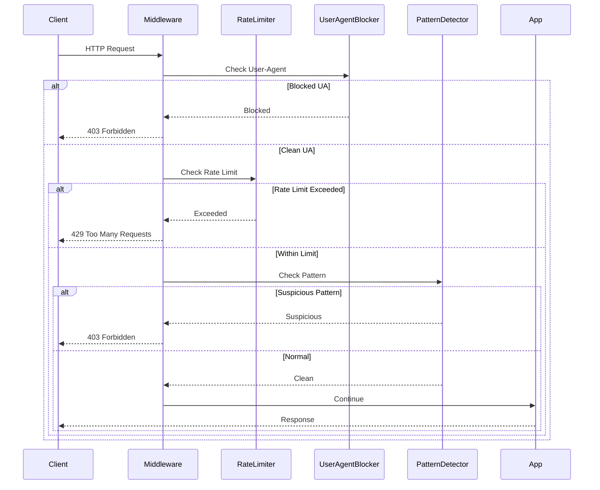

# Rencana Proteksi Performance Test

## Tujuan
Mencegah user melakukan performance test pada aplikasi web yang di-deploy di Vercel menggunakan kombinasi Rate Limiting, User-Agent Blocking, dan Request Pattern Detection.

## Arsitektur Solusi



## Komponen Proteksi

### 1. Rate Limiting
**Tujuan:** Membatasi jumlah request per IP dalam periode waktu tertentu.

**Implementasi:**
- Gunakan **Vercel KV** (Redis) untuk menyimpan counter request
- Alternatif: Upstash Redis jika Vercel KV tidak tersedia
- Fallback: In-memory storage untuk development

**Konfigurasi:**
- Window: 1 menit, 5 menit, 1 jam
- Limit per window:
  - 100 request/menit
  - 500 request/5 menit
  - 1000 request/jam

**Key Storage Pattern:**
```
ratelimit:{ip}:{window} = count
```

### 2. User-Agent Blocking
**Tujuan:** Memblokir tools performance testing yang dikenali.

**Tools yang akan diblokir:**
- Apache Bench (`ab/`)
- JMeter (`Apache-JMeter`)
- k6 (`k6/`)
- Locust (`locust/`)
- Gatling (`Gatling`)
- wrk (`wrk/`)
- hey (`hey/`)
- ApacheBench (`ApacheBench`)
- Go-http-client (`Go-http-client`)
- Postman (`PostmanRuntime`)
- curl (`curl/`)
- wget (`wget/`)

**Whitelist:**
- Browser modern (Chrome, Firefox, Safari, Edge)
- Vercel bots
- Google bots

### 3. Request Pattern Detection
**Tujuan:** Mendeteksi pola request yang mencurigakan.

**Pattern yang dideteksi:**
- Request terlalu cepat (burst requests)
- Request dengan interval yang sama persis (automated pattern)
- Request ke endpoint yang sama berulang kali
- Request tanpa referer yang mencurigakan

**Implementasi:**
- Tracking timestamp request per IP
- Sliding window untuk burst detection
- Pattern matching untuk interval request

## Struktur File

```
src/
├── lib/
│   ├── rate-limiter.ts       # Rate limiting logic
│   ├── user-agent-blocker.ts # User-Agent blocking logic
│   ├── pattern-detector.ts   # Request pattern detection
│   └── security.ts           # Security utility functions
├── middleware.ts              # Update dengan proteksi security
└── app/
    └── api/
        └── security/
            └── status/       # Endpoint untuk cek status security
                └── route.ts
```

## Dependency Tambahan

```json
{
  "dependencies": {
    "@upstash/redis": "^1.34.0",  // Untuk rate limiting
    "fingerprintjs": "^4.5.0"     // Opsional untuk device fingerprinting
  }
}
```

## Environment Variables

```env
# Rate Limiting
UPSTASH_REDIS_REST_URL=
UPSTASH_REDIS_REST_TOKEN=
# atau
VERCEL_KV_URL=

# Security Settings
RATE_LIMIT_ENABLED=true
USER_AGENT_BLOCK_ENABLED=true
PATTERN_DETECTION_ENABLED=true
```

## Flow Middleware



## Response Format

### 403 Forbidden (User-Agent Blocked)
```json
{
  "success": false,
  "error": "Forbidden",
  "message": "Your request has been blocked due to suspicious activity"
}
```

### 429 Too Many Requests (Rate Limit)
```json
{
  "success": false,
  "error": "Too Many Requests",
  "message": "Rate limit exceeded. Please try again later.",
  "retryAfter": 60
}
```

### 403 Forbidden (Suspicious Pattern)
```json
{
  "success": false,
  "error": "Forbidden",
  "message": "Suspicious request pattern detected"
}
```

## Vercel-Specific Configuration

### next.config.js
```javascript
const nextConfig = {
  reactStrictMode: true,
  headers: async () => [
    {
      source: '/(.*)',
      headers: [
        {
          key: 'X-RateLimit-Limit',
          value: '100'
        },
        {
          key: 'X-RateLimit-Remaining',
          value: '100'
        },
        {
          key: 'X-RateLimit-Reset',
          value: '60'
        }
      ]
    }
  ]
}
```

### vercel.json (Opsional untuk rate limiting)
```json
{
  "routes": [
    {
      "src": "/(.*)",
      "headers": {
        "X-Content-Type-Options": "nosniff",
        "X-Frame-Options": "DENY",
        "X-XSS-Protection": "1; mode=block"
      }
    }
  ]
}
```

## Monitoring dan Logging

- Log semua request yang diblokir
- Track IP yang mencurigakan
- Dashboard untuk monitoring security

## Testing

### Test Cases:
1. Rate limiting dengan normal user
2. Rate limiting dengan burst requests
3. User-Agent blocking dengan Apache Bench
4. User-Agent blocking dengan browser normal
5. Pattern detection dengan automated requests
6. Pattern detection dengan normal user flow

## Prioritas Implementasi

1. **High Priority:** User-Agent Blocking (paling mudah, immediate impact)
2. **High Priority:** Rate Limiting (core protection)
3. **Medium Priority:** Request Pattern Detection (advanced protection)
4. **Low Priority:** Monitoring dan Dashboard

## Catatan Penting

- Proteksi ini mencegah performance test yang agresif, bukan menghalangi user normal
- Rate limiting perlu disesuaikan berdasarkan traffic normal aplikasi
- User-Agent blocking perlu whitelist untuk tools yang valid (Postman untuk development)
- Pattern detection perlu tuning untuk menghindari false positive
